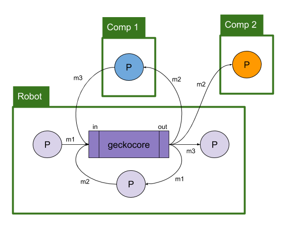
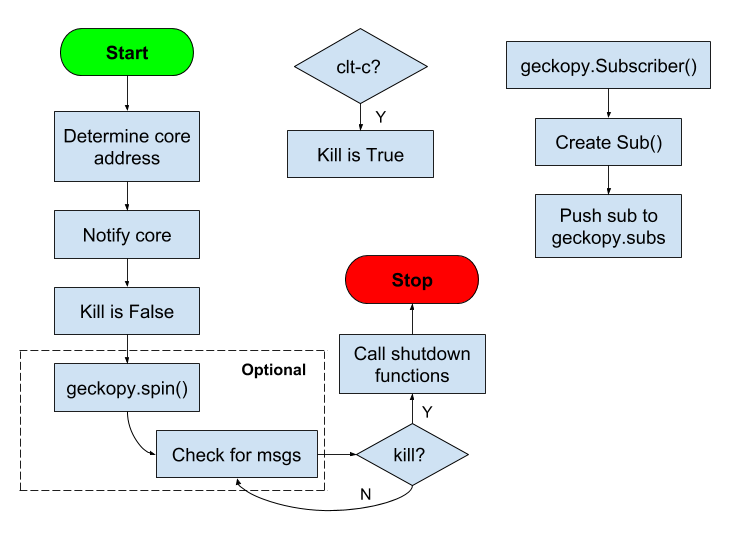

# :lizard:  pyGecko

## My robot software.

- Doesn't use [ROS](http://ros.org), ROS is a pain to install and maintain
on macOS and various linux systems
    - Uses some of the same ideas, constructs, architecture ideas, APIs but
    not strictly adhering to them
- Uses [Zero MQ](http://http://zeromq.org/) as the inter-process communication
(uses both TCP and UDS) instead of RPC-XML
    - looked at Google's protobuf, but was more complex than I needed
    - looked at [`msgpack`](https://msgpack.org/index.html) to serialize data but it was slower for `namedtuples`
    - right now using `pickle` to serialize data
    - instead of `roscore` use `geckocore.py` as the message hub
        - produces performance data (see below)
    - instead of `roslaunch` use `geckolaunch.py`
- `simplejson`/`pyyaml` - config and launch files
- All of this runs on [Raspberry Pi 3](http://www.raspberrypi.org)
    - Also runs on macOS (UNIX) and Windows

# Architecture



- GeckoCore is a main message hub and calculates statistics for data through put and node cpu/memory usage
    - Actually, when gecko processes start up, they tell geckocore their pid numbers so it can track usage using `psutil` library
    - Obviously this only works on processes located on the same machine as geckocore
- Any number of pubs can talk to any number of sub ... it is not a one-to-one relationship.
- Subscriber can subscribe to multiple topics
- Publishers are not bound to any one topic, but can also publish to multiple topics

## `geckocore.py`

This is the main message hub and keeps track of messages statistics that pass
through it along with connections.

```bash
+------------------------------------------------------------
| GeckoCore[32871].............. cpu:   6.7%    mem:   0.06%
| Total messages seen: 1058
+------------------------------
| LISTEN 192.168.86.213:9998 connected to None:None
| LISTEN 192.168.86.213:9999 connected to None:None
| ESTABLISHED 192.168.86.213:9998 connected to 192.168.86.213:49793
| ESTABLISHED 192.168.86.213:9998 connected to 192.168.86.213:49792
| ESTABLISHED 192.168.86.213:9999 connected to 192.168.86.213:49794
| ESTABLISHED 192.168.86.213:9999 connected to 192.168.86.213:49795
| ESTABLISHED 192.168.86.213:9999 connected to 192.168.86.213:49796
| ESTABLISHED 192.168.86.213:9999 connected to 192.168.86.213:49797
| ESTABLISHED 192.168.86.213:9999 connected to 192.168.86.213:49798
| ESTABLISHED 192.168.86.213:9999 connected to 192.168.86.213:49799
| ESTABLISHED 192.168.86.213:9998 connected to 192.168.86.213:49800
+------------------------------
 hello.........................   39.3 msgs/s      1.8 kB/s
 hey there.....................   39.3 msgs/s      1.8 kB/s
 cv............................   14.3 msgs/s   4298.6 kB/s
```
geckocore also is passed the PIDs for processes on the local machine and
prints performance data on each process:

```bash
+------------------------------
| Alive processes: 9
+------------------------------
| subscribe2[32880]............. cpu:   3.5%    mem:   0.07%
| subscribe2[32882]............. cpu:   3.5%    mem:   0.07%
| subscribe2[32885]............. cpu:   2.2%    mem:   0.08%
| subscribe2[32884]............. cpu:   2.2%    mem:   0.08%
| pcv[32886].................... cpu:   5.7%    mem:   0.18%
| subscribe2[32881]............. cpu:   3.5%    mem:   0.07%
| subscribe2[32883]............. cpu:   3.4%    mem:   0.07%
| publish[32879]................ cpu:   0.9%    mem:   0.07%
| publish[32878]................ cpu:   0.9%    mem:   0.07%
```

Note that the topics above are: `hello`, `hey there`, and `cv`. They can be any string.

## `geckolaunch.py`


```bash
                                geckocore
              spawn | pub --\  +---------+  /---> sub
geckolaunch ------->| pub ---->|in    out|------> sub
                    | pub --/  +---------+  \---> sub
                                             \--> sub
```

`geckolaunch.py` allows you to launch a bunch of processes quickly using a launch
file. A launch file is just a simple json file where each line takes the form:
`[file, function, kwargs]`. Here is an example:

```bash
{
  "processes":
  [
    ["process", "publish", {"topic": "hello"}],
    ["process", "publish", {"topic": "hey there"}],
    ["process", "subscribe2", {"topic": "hello"}],
    ["process", "subscribe2", {"topic": "hello"}],
    ["process", "subscribe2", {"topic": "hey there"}],
    ["process", "subscribe2", {"topic": "hey there"}],
    ["process", "subscribe2", {"topic": "cv"}],
    ["process", "subscribe2", {"topic": "cv"}],
    ["process", "pcv", {"topic": "cv"}]
  ],
  "geckocore": {
      "type": "tcp",
      "in": ["localhost", 9998],
      "out": ["localhost", 9999]
  }
}
```

OR you can use a hostname as a `geckocore` key to find it on the network. Here
the machine `bob.local` has a core we want to talk to:

```bash
{
  "processes":
  [...],
  "geckocore": {
      "key": "bob"
  }
}
```


Here we have a bunch of functions (`publish`,  `subscribe2`, and `pcv`) located in a
python file called `process.py` (note, the `.py` file extension is assumed because
`pygecko` uses `import` to load these functions. There is no reason eveything has
to be located in one file, I was just lazy when I wrote this example and did
a lot of copy/paste. :smile:

There are a bunch of `kwargs` (dictionaries) that are passed to the functions full
of whatever args you want to pass. In this example, the args are mostly just
topic names to pub/sub to.

## `geckopy`



See the examples, but this acts like a `rospy` and helps make writing
pub/sub processes easy. See the `/examples` folder to see it in action.

- **init_node:** this sets up the the process for communications with `geckocore`
- **logxxx:** prints log messages
    ```python
    from pygecko import geckopy
    geckopy.loginfo('this is a info message')  # just send a string
    geckopy.logwarn('this is a warning message')
    geckopy.logerror('this is a error message')
    geckopy.logdebug('this is a debug message')
    ```
- **on_shutdown:** pushes a function to a stack (FIFO) that will be called when `geckopy`
shutsdown
- **Subscriber:** creates a subscriber and appends the callback function to an
array in geckopy
- **Publisher:** creates a publisher and returns it
- **Rate:** given a frequency of how often a loop should run (i.e., 10Hz), the
returned object will dynamically set the sleep interval to achieve the rate. Ex:
    ```python
    from pygecko import geckopy
    rate = geckopy.Rate(20)  # run loop at 20 Hz
    while True:
        rate.sleep()
    ```
### Where is GeckoCore?

`geckopy` resolves the core address in the following order

1. `kwargs` passed to `geckopy` contains the address. This allows you to over ride
talking to a `geckocore` running on your machine and instead talk to one on another
machine. These args can be set in your individual python file or in a launch file.
    ```python
    # use this key with multicast to find geckocore
    kwargs = {
        "geckocore":
            {
                "key": "bob"
            }
    }

    # OR
    # tcp ip/hostname and port number
    kwargs = {
        "geckocore":{
                "type": "tcp",
                "in": ["bob.local", 12345],
                "out": ["bob.local", 23456]
            }
    }

    # OR
    # unix domain sockets, only works on linux/unix
    kwargs = {
        "geckocore":{
                "type": "uds",
                "in": "ipc://file/path",
                "out": "ipc://file/path"
            }
    }

    # OR
    # zmq address, either tcp or uds
    kwargs = {
        "geckocore":{
                # this can be tcp or uds address for zmq
                "in_addr": "tcp://1.2.3.4:1234",
                "out_addr": "tcp://1.2.3.4:2345"
            }
    }
    ```
1. Multicast beacon to find `geckocore`
    - `geckopy.init_node()` sends a multicast ping out to the local network
    - `geckocore` hears it and returns its address info
        - Since there could be many `geckocores` running on different machines
          on the local network, a *key* is used to get the response you want.
          The key is based off the host name
1. If `/tmp/gecko*.json` exists, then use the address in there. `geckocore` creates this file and it only works for processes running on the *same* machine as `geckocore`
1. If all else fails, use the default addresses:
    - type: tcp
    - in: localhost: 9998
    - out: localhost: 9999

Ideally, when programming, you should never have to tell a sub/pub where to
connect. `geckopy` has that info for you because it was set in a launch
file, passed to `geckopy` in args, the data is found in a temp file in the
tmp directory, or we fall back to the default values.

So what do you have to know to get `geckocore`'s info?

| Method   | Key | IPv4/Zeroconfig | Ports | Scope   | Notes |
|----------|-----|-----------------|-------|---------|-------|
| `kwargs` | No  | Yes             | Yes   | Network | could get from launch file |
| Multicast| Yes | No              | No    | Network | need key for multiple cores on the network, based off hostname |
| tempfile | No  | No              | No    | Machine | fallback solution, file located in `/tmp` |
| default  | No  | No              | No    | Machine | no guarantee this will work, all else has failed |


# Change Log

Date        |Version| Notes
------------|-------|---------------------------------
2018-Sep-16 | 1.0.3 | implemented a multicast connection process
2018-Sep-16 | 1.0.2 | dropping python 2.7 support, only 3.7+
2018-Sep-11 | 1.0.1 | working, but still need to flush it out some more
2018-Jul-28 | 1.0.0 | totally nuked everything from orbit and started over
2017-May-14 | 0.8.3 | updates and refactor
2017-Apr-02 | 0.8.2 | fix pypi doc and refactor
2017-Mar-19 | 0.7.0 | refactored
2017-Mar-12 | 0.6.0 | changed messages from dict to classes
2016-Dec-26 | 0.5.0 | refactor
2016-Oct-09 | 0.4.1 | published to PyPi
2010-Mar-10 | 0.0.1 | init


# MIT License

**Copyright (c) 2010 Kevin J. Walchko**

Permission is hereby granted, free of charge, to any person obtaining a copy of
this software and associated documentation files (the "Software"), to deal in
the Software without restriction, including without limitation the rights to
use, copy, modify, merge, publish, distribute, sublicense, and/or sell copies
of the Software, and to permit persons to whom the Software is furnished to do
so, subject to the following conditions:

The above copyright notice and this permission notice shall be included in all
copies or substantial portions of the Software.

THE SOFTWARE IS PROVIDED "AS IS", WITHOUT WARRANTY OF ANY KIND, EXPRESS OR
IMPLIED, INCLUDING BUT NOT LIMITED TO THE WARRANTIES OF MERCHANTABILITY, FITNESS
FOR A PARTICULAR PURPOSE AND NONINFRINGEMENT. IN NO EVENT SHALL THE AUTHORS OR
COPYRIGHT HOLDERS BE LIABLE FOR ANY CLAIM, DAMAGES OR OTHER LIABILITY, WHETHER
IN AN ACTION OF CONTRACT, TORT OR OTHERWISE, ARISING FROM, OUT OF OR IN
    CONNECTION WITH THE SOFTWARE OR THE USE OR OTHER DEALINGS IN THE SOFTWARE.
